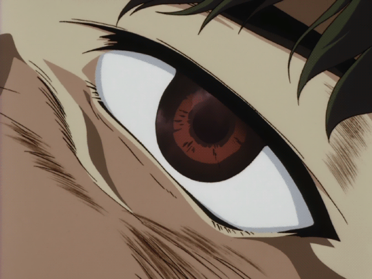
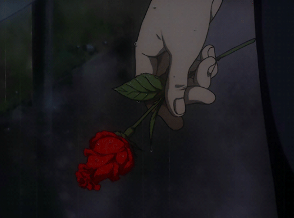

 

  

<table align="center">
<tr>

<td width="50%" align="center">

<h4>Tech Stack</h4>

 

</td>

<td width="50%" align="center">

</td>

</tr>
</table>

---

      

<h3 align="center">Statistics</h3>

<table align="center">
<tr>

<td width="50%" align="center">

</td>

<td width="50%" align="center">

</td>

</tr>
</table>

---

      

<h3 align="center">Contribution Graph</h3>

  

---

       

  

🌹

